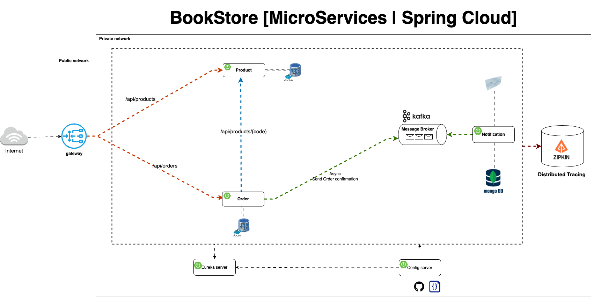

<a href="README_CN.md">中文文档</a>

Build resilient and scalable microservices using Spring Cloud, Istio, and Kubernetes.

## Modules

- chapter01：Restful、SpringDoc、Resilience4j、RestClient、Redis
- chapter02：Rabbitmq
- chapter03：Kafka
- chapter04：Spring Cloud Stream
- chapter05：Zipkin Feign
- chapter06: Loki
- chapter07：ELK
- chapter08：Grafana
- chapter09：Spring Boot Admin Server
- chapter10：Eureka
- chapter11：Feign
- chapter12：Circuit Breaker
- chapter13：Spring Cloud Gateway
- chapter14：Spring Cloud Config
- chapter15：Helm
- chapter16：Kubernetes
- chapter17：Istio
- chapter18: Service Mesh
- chapter19: Native

## Tech Stack

* Building Spring Boot REST APIs
* Creating Aggregated Swagger Documentation at API Gateway
* Database Persistence using Spring Data JPA, MySQL, Mongodb, Flyway
* Distributed Tracing using Zipkin
* Distributed Logging using ELK, Loki
* Event Driven Async Communication using Spring Kafka, RabbitMQ, ActiveMQ, Spring Cloud Stream
* Implementing API Gateway using Spring Cloud Gateway
* Implementing Resiliency using Resilience4j
* Using WebClient, Declarative HTTP Interfaces to invoke other APIs
* Local Development Setup using Docker, Docker Compose and Testcontainers
* Monitoring & Observability using Grafana, Prometheus, Tempo
* Testing using JUnit 5, RestAssured, Testcontainers, Awaitility, WireMock
* Deployment to Kubernetes using Kind, Helm

| Tech stack                              | Used Version | Latest Version                                                                                                                                                                                                                        | Notes |
|-----------------------------------------|--------------|---------------------------------------------------------------------------------------------------------------------------------------------------------------------------------------------------------------------------------------|-------|
| Spring Boot                             | 3.4.4        |      |       |
| Spring Cloud                            | 2024.0.1     |  |       |
| SpringDoc OpenAPI                       | 2.8.6        |                                            |       |
| Spring Boot Admin                       | 3.4.5        |                                    |       |

## Local Development Setup

- Install Java 21 and Maven 3. Recommend using [SDKMAN](https://sdkman.io/).
- Install [Docker](https://www.docker.com/). Recommend using [OrbStack](https://orbstack.dev/) for Macos.
- Install [IntelliJ](https://www.jetbrains.com/idea) IDEA or any of your favorite IDE
- Install [Postman](https://www.postman.com/) or any REST Client

## References

Video：

- [Mastering Microservices: Spring boot, Spring Cloud and Keycloak In 7 Hours](https://www.youtube.com/watch?v=jdeSV0GRvwI)
- [Distributed version of the Spring PetClinic Sample Application built with Spring Cloud and Spring AI](https://github.com/odedia/spring-boot3-microservices)
- [Spring Boot 3 Microservices with Kubernetes and Angular Complete Course in 7 Hours](https://www.youtube.com/watch?v=yn_stY3HCr8)

Code：

- https://github.com/chensoul/spring-boot-microservices-course
- https://github.com/chensoul/Microservices-with-Spring-Boot-and-Spring-Cloud-Third-Edition
- https://github.com/eazybytes/microservices Grafana + Prometheus + Loki + Tempo
- https://github.com/abhisheksr01/spring-boot-microservice-best-practices
- https://github.com/chensoul/spring-petclinic-microservices
- https://github.com/chensoul/spring-boot-3-microservices-course
- https://github.com/in28minutes/spring-microservices-v3
- https://github.com/ali-bouali/microservices-full-code
- https://github.com/jhipster/jhipster-lite
- https://github.com/sivaprasadreddy/spring-boot-microservices-series
- https://github.com/Nasruddin/spring-boot-based-microservices